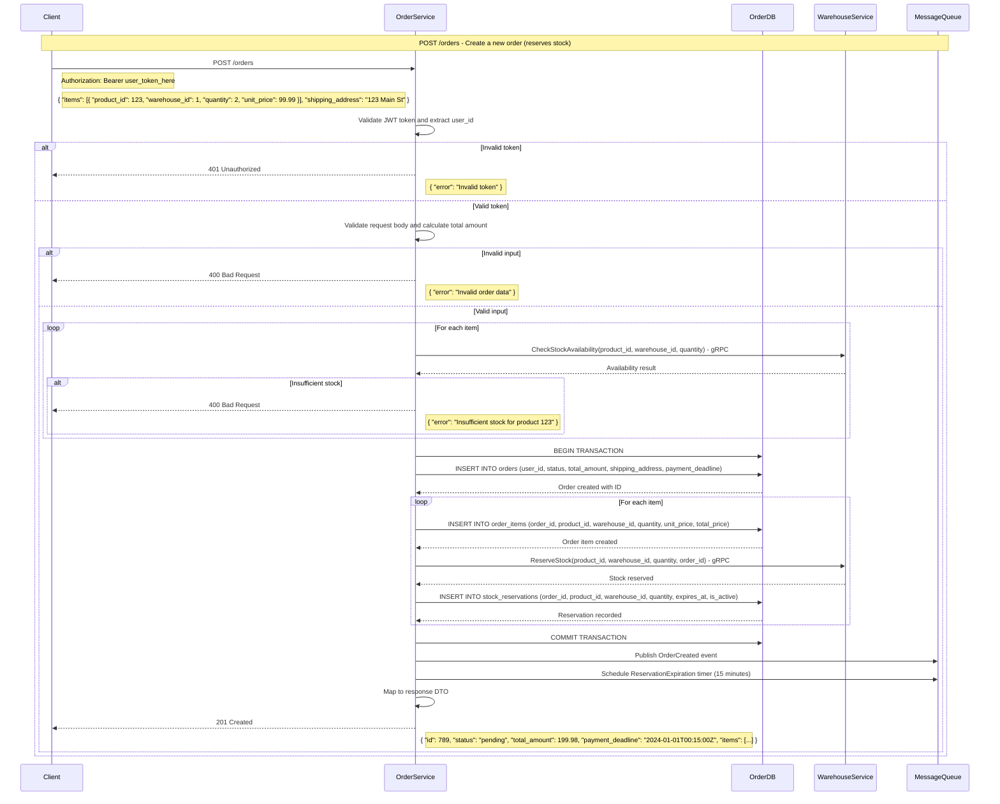
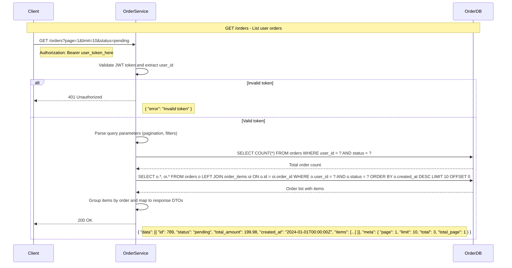
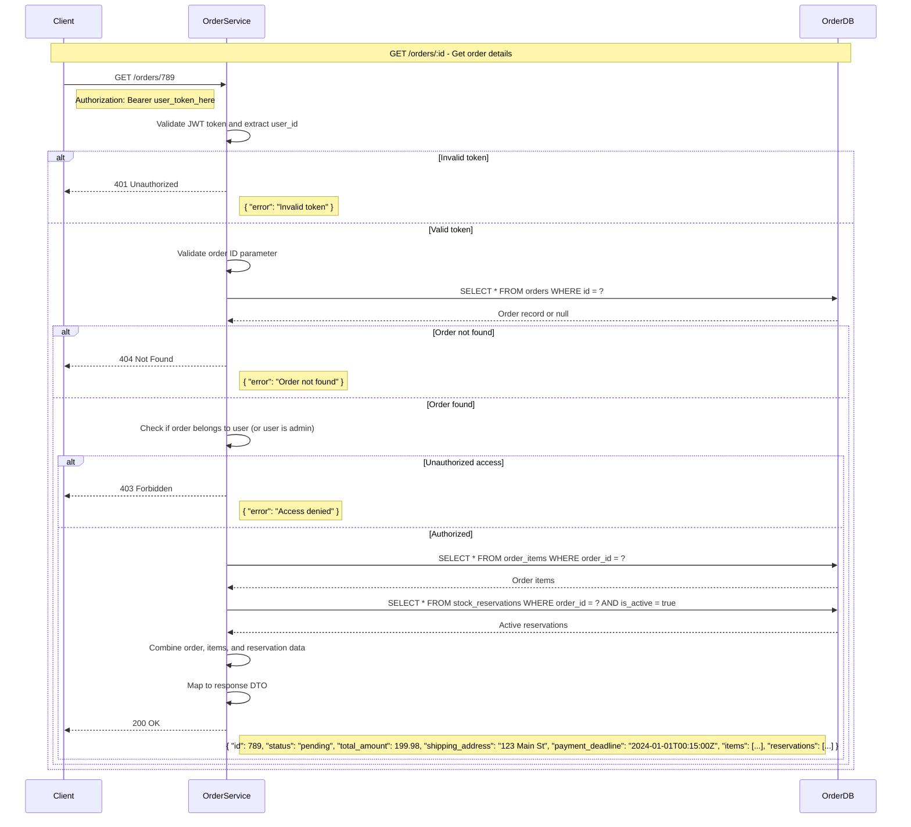
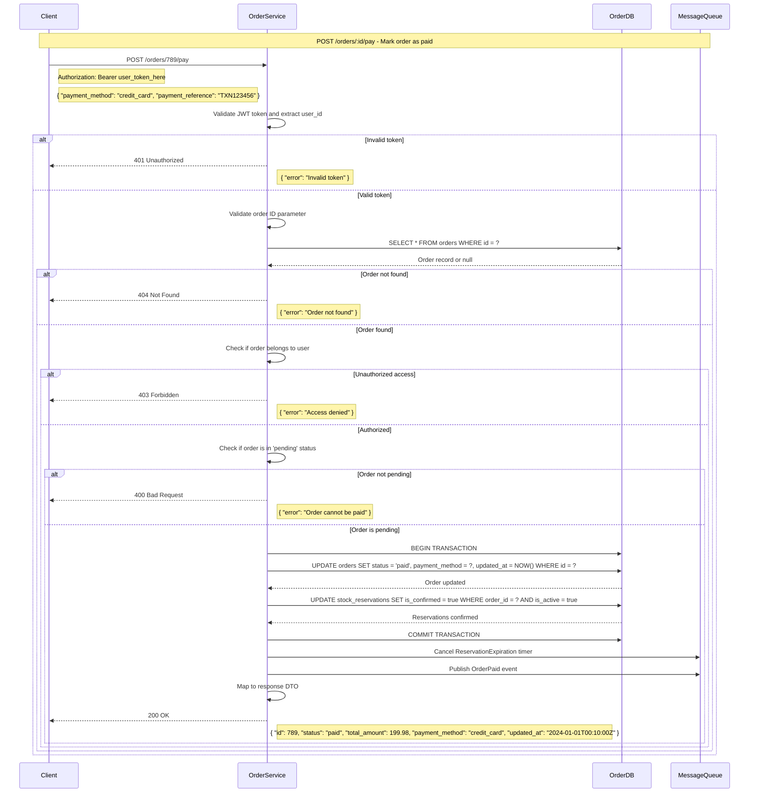
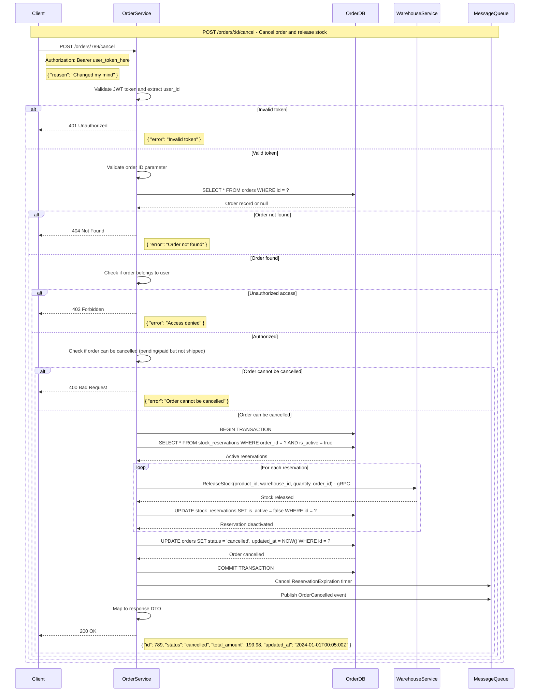
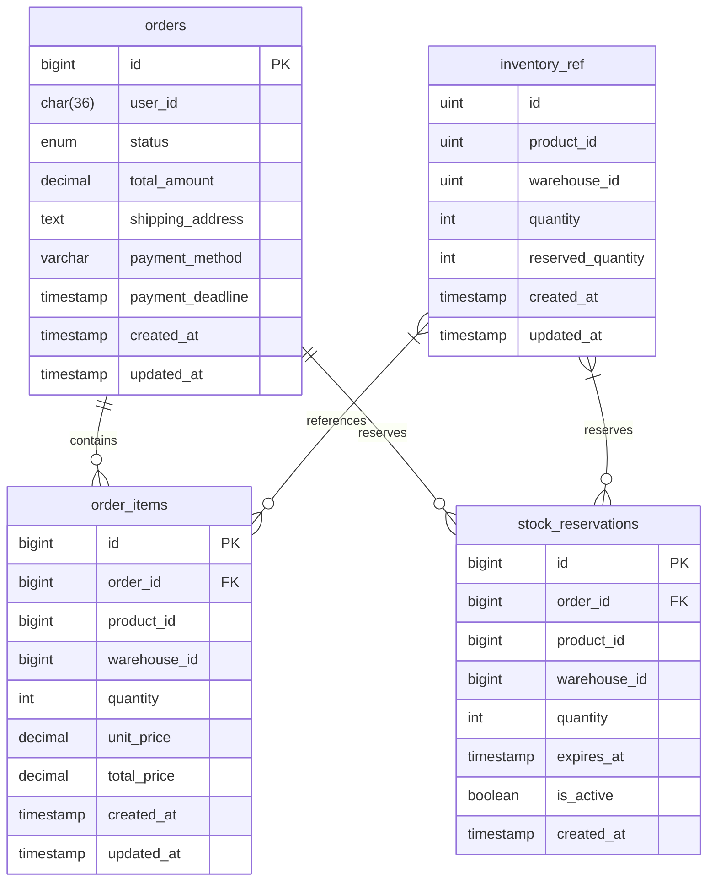

# Order Service

A RESTful API service for order processing, stock reservation, and payment handling built with Go, Fiber framework, and MySQL.

## Features

- Order creation and management
- Advanced stock reservation with database-level locking
- Real-time inventory tracking with optimistic concurrency control
- Atomic stock operations to prevent overselling
- Payment processing
- API Key authentication
- Clean architecture design (repository, usecase, handler)
- MySQL database with migrations
- Containerized with Docker
- Standardized error handling with custom error types
- Request ID tracking for API calls
- Structured JSON logging with context
- Timeout handling and context management
- Consistent API responses
- Swagger/OpenAPI documentation
- External warehouse service integration (both sync and async modes)

## Prerequisites

To run this application, you need:

- Docker and Docker Compose
- Go 1.24+ (for local development)

## Running with Docker

1. Clone the repository:
   ```
   git clone <repository-url>
   cd order-service
   ```

2. Start the services using Docker Compose:
   ```
   docker-compose up -d
   ```

   This will:
   - Build the order service container
   - Start a MySQL container
   - Run database migrations
   - Start the application on port 3000

3. Access the API at:
   ```
   http://localhost:3000/api/v1
   ```

4. Access the API documentation at:
   ```
   http://localhost:3000/swagger/
   ```

## API Endpoints

### API Authentication

All API endpoints require API key authentication. Include the API key in the `X-API-Key` header:

```
X-API-Key: order-service-api-key
```

### Health Check

```
GET /api/v1/health
```

Example curl command:
```bash
curl -X GET http://localhost:3000/api/v1/health \
  -H "X-API-Key: order-service-api-key"
```

### Order Endpoints

#### Create Order

```
POST /api/v1/orders
```

Example curl command:
```bash
curl -X POST http://localhost:3000/api/v1/orders \
  -H "X-API-Key: order-service-api-key" \
  -H "Content-Type: application/json" \
  -d '{
    "user_id": "user123",
    "shipping_address": "123 Main St, City, Country",
    "payment_method": "credit_card",
    "items": [
      {
        "product_id": 1,
        "warehouse_id": 1,
        "quantity": 2,
        "unit_price": 19.99
      },
      {
        "product_id": 2,
        "warehouse_id": 1, 
        "quantity": 1,
        "unit_price": 29.99
      }
    ]
  }'
```

#### Get Order

```
GET /api/v1/orders/{id}
```

Example curl command:
```bash
curl -X GET http://localhost:3000/api/v1/orders/1 \
  -H "X-API-Key: order-service-api-key"
```

#### Get User Orders

```
GET /api/v1/orders?user_id=user123&page=1&limit=10
```

Example curl command:
```bash
curl -X GET "http://localhost:3000/api/v1/orders?user_id=user123&page=1&limit=10" \
  -H "X-API-Key: order-service-api-key"
```

#### Update Order Status

```
PATCH /api/v1/orders/{id}/status
```

Example curl command:
```bash
curl -X PATCH http://localhost:3000/api/v1/orders/1/status \
  -H "X-API-Key: order-service-api-key" \
  -H "Content-Type: application/json" \
  -d '{
    "status": "paid"
  }'
```

> **Note**: To cancel an order, use this endpoint with `{"status": "cancelled"}`. The system will automatically release reserved stock.

#### Process Payment

```
POST /api/v1/orders/{id}/payment
```

Example curl command:
```bash
curl -X POST http://localhost:3000/api/v1/orders/1/payment \
  -H "X-API-Key: order-service-api-key"
```

### Reservation Endpoints

#### Create Reservation

```
POST /api/v1/reservations
```

Example curl command:
```bash
curl -X POST http://localhost:3000/api/v1/reservations \
  -H "X-API-Key: order-service-api-key" \
  -H "Content-Type: application/json" \
  -d '{
    "order_id": 1,
    "product_id": 1,
    "warehouse_id": 1,
    "quantity": 5,
    "expires_at": "2025-05-25T15:00:00Z"
  }'
```

#### Get Order Reservations

```
GET /api/v1/orders/{order_id}/reservations
```

Example curl command:
```bash
curl -X GET http://localhost:3000/api/v1/orders/1/reservations \
  -H "X-API-Key: order-service-api-key"
```

#### Deactivate Reservation

```
POST /api/v1/reservations/{id}/deactivate
```

Example curl command:
```bash
curl -X POST http://localhost:3000/api/v1/reservations/1/deactivate \
  -H "X-API-Key: order-service-api-key"
```

#### Cleanup Expired Reservations

```
POST /api/v1/reservations/cleanup
```

Example curl command:
```bash
curl -X POST http://localhost:3000/api/v1/reservations/cleanup \
  -H "X-API-Key: order-service-api-key"
```

### Inventory Endpoints

These endpoints are proxy interfaces to the external warehouse service, providing a unified API for inventory operations.

#### Get Product Inventory

```
GET /api/v1/inventory/{product_id}/{warehouse_id}
```

Example curl command:
```bash
curl -X GET http://localhost:3000/api/v1/inventory/1/1 \
  -H "X-API-Key: order-service-api-key"
```

#### Get Batch Inventory

```
POST /api/v1/inventory/batch
```

Example curl command:
```bash
curl -X POST http://localhost:3000/api/v1/inventory/batch \
  -H "X-API-Key: order-service-api-key" \
  -H "Content-Type: application/json" \
  -d '{
    "items": [
      {
        "product_id": 1,
        "warehouse_id": 1
      },
      {
        "product_id": 2,
        "warehouse_id": 1
      }
    ]
  }'
```

#### Reserve Stock

```
POST /api/v1/inventory/reserve
```

Example curl command:
```bash
curl -X POST http://localhost:3000/api/v1/inventory/reserve \
  -H "X-API-Key: order-service-api-key" \
  -H "Content-Type: application/json" \
  -d '{
    "order_id": 1,
    "items": [
      {
        "product_id": 1,
        "warehouse_id": 1,
        "quantity": 2,
        "unit_price": 19.99
      }
    ],
    "reserve_until": "2025-05-20T15:00:00Z"
  }'
```

#### Confirm Stock Deduction

```
POST /api/v1/inventory/confirm
```

Example curl command:
```bash
curl -X POST http://localhost:3000/api/v1/inventory/confirm \
  -H "X-API-Key: order-service-api-key" \
  -H "Content-Type: application/json" \
  -d '{
    "order_id": 1,
    "reservation_id": "res_123"
  }'
```

#### Release Reservation

```
POST /api/v1/inventory/release
```

Example curl command:
```bash
curl -X POST http://localhost:3000/api/v1/inventory/release \
  -H "X-API-Key: order-service-api-key" \
  -H "Content-Type: application/json" \
  -d '{
    "order_id": 1,
    "reservation_id": "res_123"
  }'
```

## Order Flow Sequence Diagram



### Order Listing Flow



### Order Detail Flow



### Order Payment Flow



### Order Cancellation Flow



## Warehouse Service Integration

The order service integrates with an external warehouse service to handle inventory operations. This integration can operate in either synchronous (HTTP) or asynchronous (RabbitMQ) mode.

### Configuration

Configure warehouse service integration in `config.json`:

```json
"warehouse": {
  "base_url": "http://localhost:3001",
  "timeout": "15s",
  "api_key": "",
  "max_retries": 3,
  "retry_delay": "1s", 
  "async_mode": false,
  "queue_name": "inventory-operations",
  "mq_address": "localhost:5672",
  "mq_username": "guest",
  "mq_password": "guest"
}
```

- `async_mode`: Set to `false` for direct HTTP calls, `true` for RabbitMQ messaging
- `timeout`: HTTP client timeout (increased from 5s to 15s to prevent timeouts)

### Warehouse API Endpoints

#### Check and Reserve Stock

Reserves inventory for order items.

```
POST /api/v1/inventory/reserve
```

Example curl command:
```bash
curl -X POST http://localhost:3001/api/v1/inventory/reserve \
  -H "Content-Type: application/json" \
  -d '{
    "order_id": 123,
    "order_items": [
      {
        "product_id": 1,
        "warehouse_id": 1,
        "quantity": 2,
        "unit_price": 19.99
      }
    ],
    "reserve_until": "2025-05-20T15:00:00Z"
  }'
```

#### Confirm Stock Deduction

Confirms reserved stock as sold after payment.

```
POST /api/v1/inventory/commit
```

Example curl command:
```bash
curl -X POST http://localhost:3001/api/v1/inventory/commit \
  -H "Content-Type: application/json" \
  -d '{
    "reservation_id": "res_123",
    "order_id": 123
  }'
```

#### Release Reservation

Releases stock back to available inventory (e.g., cancelled order).

```
POST /api/v1/inventory/cancel
```

Example curl command:
```bash
curl -X POST http://localhost:3001/api/v1/inventory/cancel \
  -H "Content-Type: application/json" \
  -d '{
    "reservation_id": "res_123",
    "order_id": 123
  }'
```

#### Get Inventory

Gets current inventory level for a specific product.

```
POST /api/v1/inventory/get
```

Example curl command:
```bash
curl -X POST http://localhost:3001/api/v1/inventory/get \
  -H "Content-Type: application/json" \
  -d '{
    "product_id": 1,
    "warehouse_id": 1
  }'
```

#### Get Inventory Batch

Gets inventory levels for multiple products at once.

```
POST /api/v1/inventory/batch
```

Example curl command:
```bash
curl -X POST http://localhost:3001/api/v1/inventory/batch \
  -H "Content-Type: application/json" \
  -d '{
    "items": [
      {
        "product_id": 1,
        "warehouse_id": 1
      },
      {
        "product_id": 2,
        "warehouse_id": 1
      }
    ]
  }'
```

#### Update Inventory

Updates inventory quantity (admin operation).

```
POST /api/v1/inventory/update
```

Example curl command:
```bash
curl -X POST http://localhost:3001/api/v1/inventory/update \
  -H "Content-Type: application/json" \
  -d '{
    "product_id": 1,
    "warehouse_id": 1,
    "quantity": 100,
    "reserved_quantity": 5
  }'
```

### Response Format

Successful response:
```json
{
  "success": true,
  "data": { ... }
}
```

Error response:
```json
{
  "success": false,
  "error": {
    "code": "ERROR_CODE",
    "message": "Human readable error message"
  }
}
```

## Local Development

1. Install dependencies:
   ```
   go mod download
   ```

2. Start a local MySQL instance or update the config.json with your database details

3. Run the application:
   ```
   make run
   ```

4. Run unit tests:
   ```
   make test-run
   ```

## End-to-End Testing

The project includes end-to-end tests that verify the complete order flow by testing against a running service.

1. Run E2E tests with Docker (recommended):
   ```
   make test-e2e
   ```

2. Run E2E tests with logs for debugging:
   ```
   make test-e2e-with-logs
   ```

Test results are saved in the `test-results` directory.

## Project Structure

- `/cmd/web`: Main application entry point
- `/internal`: Internal application code
  - `/config`: Configuration handling
  - `/context`: Context management for timeouts and request tracking
  - `/delivery`: HTTP delivery layer
    - `/http/middleware`: HTTP middleware (logging, auth)
    - `/http/response`: Standardized response formatting
    - `/http/route`: API route definitions
  - `/entity`: Domain entities
  - `/errors`: Custom error types and error handling
  - `/gateway`: External service integrations
    - `/warehouse`: Warehouse service client and gateway
  - `/handler`: HTTP handlers
  - `/model`: Data models and DTOs
  - `/repository`: Data access layer
  - `/usecase`: Business logic layer
  - `/factory`: Dependency factories
- `/db/migrations`: Database migration files
- `/docs`: Swagger documentation
- `/e2e`: End-to-end tests
- `/mocks`: Mock interfaces for testing

## Configuration

Configuration is stored in `config.json`. For Docker, use `config.docker.json`.

Key configurations:
- Web server port (default: 3000)
- Database connection parameters
- Logging level (0-6, with 6 being most verbose)
- Warehouse service configuration (sync vs async, timeout, etc.)

## Error Handling

The service uses a standardized error handling approach:
- Custom error types with error codes and HTTP status codes
- Consistent error response format
- Contextual error logging
- Request tracking with request IDs

## Logging

Logs are output in JSON format and include:
- Timestamp
- Log level
- Request ID for request tracing
- Contextual information
- Method and path for API requests
- Response status and latency
- SQL query tracing (in debug mode)

## Database Schema

The service uses the following database schema:



Note: The `inventory_ref` entity is not stored in the database but represents the inventory data managed by the external warehouse service. The service initially had a local `inventory` table but has migrated to using the external warehouse service exclusively.

### Entity Relationship Explanation

1. **Orders to Order Items (1:Many)**
   - Each order can contain multiple order items
   - Order items are tied to a specific order via foreign key
   - When an order is deleted, all its order items are automatically deleted (cascade)

2. **Orders to Stock Reservations (1:Many)**
   - Each order can have multiple stock reservations (typically one per order item)
   - Reservations are tied to a specific order via foreign key
   - Stock reservations track temporary holds on inventory for pending orders
   - When an order is deleted, all its stock reservations are automatically released (cascade)

3. **External Inventory Reference**
   - `inventory_ref` represents a conceptual entity managed by the external warehouse service
   - Order items reference specific product/warehouse combinations in the external inventory
   - Stock reservations create holds against this external inventory
   - The warehouse service is responsible for maintaining the actual inventory data

## Stock Locking Mechanism

The service implements a robust stock locking mechanism to prevent overselling:

1. **Database-Level Pessimistic Locking**:
   - Uses `FOR UPDATE` SQL clause to lock inventory rows during the checkout process
   - Prevents concurrent modifications to the same inventory items
   - Guarantees stock consistency even in high-concurrency environments

2. **Two-Phase Stock Management**:
   - Phase 1: Reservation - Locks stock with database transactions
   - Phase 2: Confirmation/Release - Either confirms the sale after payment or releases stock after expiration

3. **Automatic Inventory Updates**:
   - Stock is automatically reserved when an order is created
   - Reserved stock is deducted from available inventory in real-time
   - Stock is automatically released if payment deadline passes

4. **Inventory Tracking Table**:
   - Dedicated `inventory` table for stock management
   - Tracks both total quantity and reserved quantity
   - Available stock = total quantity - reserved quantity
   
This implementation ensures that even in high-traffic scenarios, the system maintains stock integrity and prevents selling more products than are available.

## Warehouse Service Integration Details

The order service integrates with the warehouse service using a clean architecture approach:

1. **Gateway Layer**:
   - The warehouse gateway provides an interface for all service operations
   - Implements both synchronous (HTTP) and asynchronous (RabbitMQ) backends
   - Handles request/response mapping and error translation

2. **Context Management**:
   - Uses separate contexts with explicit timeouts for service calls (10s)
   - Independent database operation contexts (30s)
   - Prevents request context cancellation from affecting critical operations

3. **Error Handling**:
   - Specific error types for common warehouse service errors
   - Comprehensive logging with request details
   - Graceful handling of timeouts and connection issues

4. **Implementation Selection**:
   - Factory pattern determines which implementation to use (sync vs. async)
   - Configuration-driven behavior selection
   - Graceful fallback from async to sync if async setup fails

## Implementation Notes

The following notes highlight some differences between the sequence diagrams and the actual implementation:

### Order Creation Flow
- The implementation uses a 24-hour payment deadline instead of the 15 minutes shown in the diagram
- Stock reservation checks are batched in a single call rather than item-by-item
- The message queue integration for OrderCreated events and ReservationExpiration timers is not yet implemented

### Order Payment Flow
- The implementation separates database transactions from external warehouse service calls for better resilience
- Database operations are committed before external service calls to ensure data consistency
- If the warehouse service call fails after payment is recorded, the order remains paid (manual reconciliation needed)
- The message queue operations are not yet implemented

### Order Cancellation Flow
- Cancellation is implemented through the UpdateOrderStatus endpoint rather than a dedicated endpoint
- The implementation focuses on database consistency first, then external service calls
- If stock release fails after cancellation is recorded, the order remains cancelled
- The implementation does not yet store cancellation reasons

### Transaction Management
- The implementation follows a pattern where database transactions are completed first
- External service calls happen after database commits to avoid long-running transactions
- This differs from the diagrams but provides better resilience against failures

### Future Enhancements
- Complete message queue integration for events and expiration timers
- Add order ownership verification for additional security
- Implement cancellation reason tracking
- Add dedicated endpoints for common operations