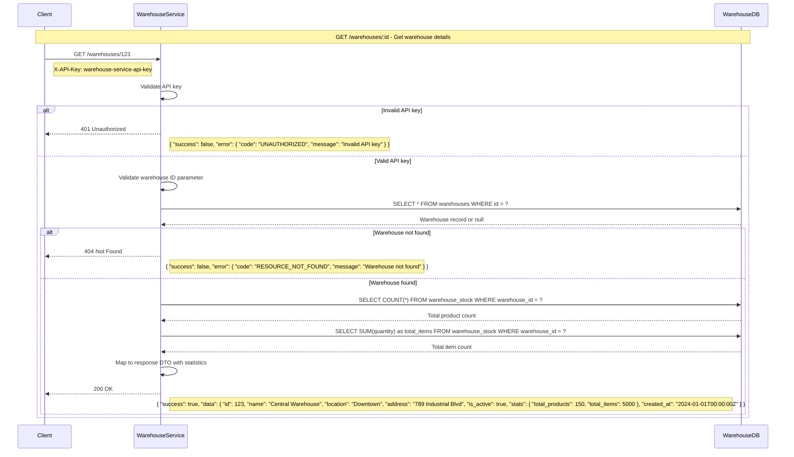
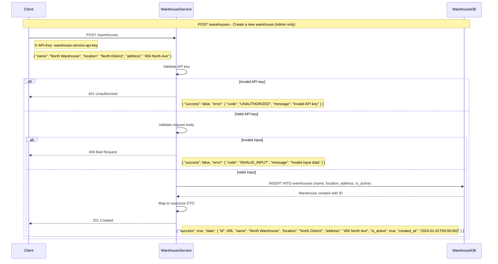
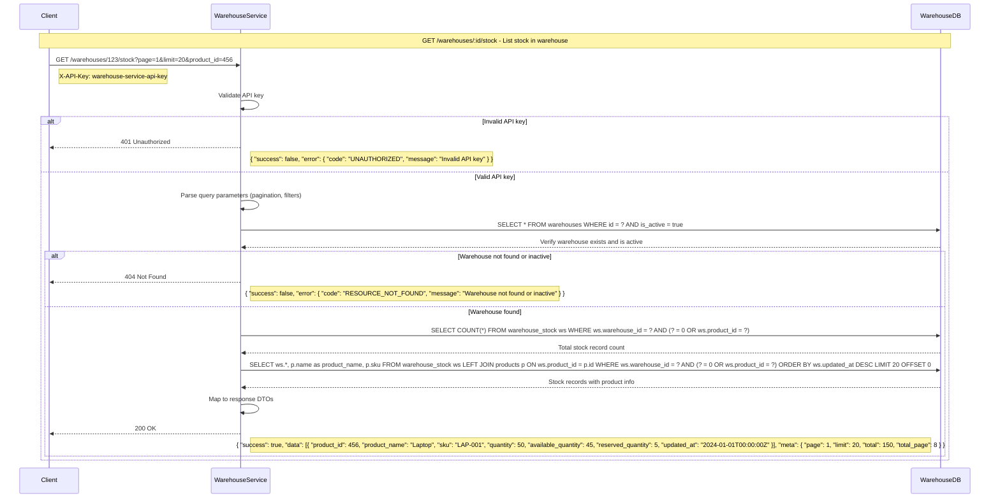
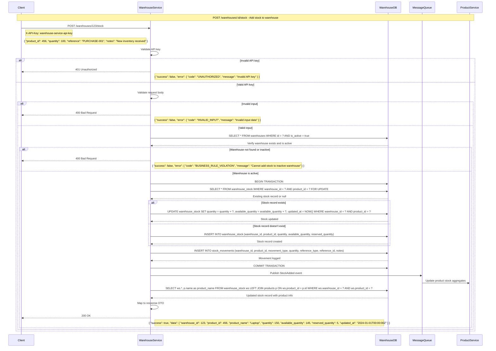
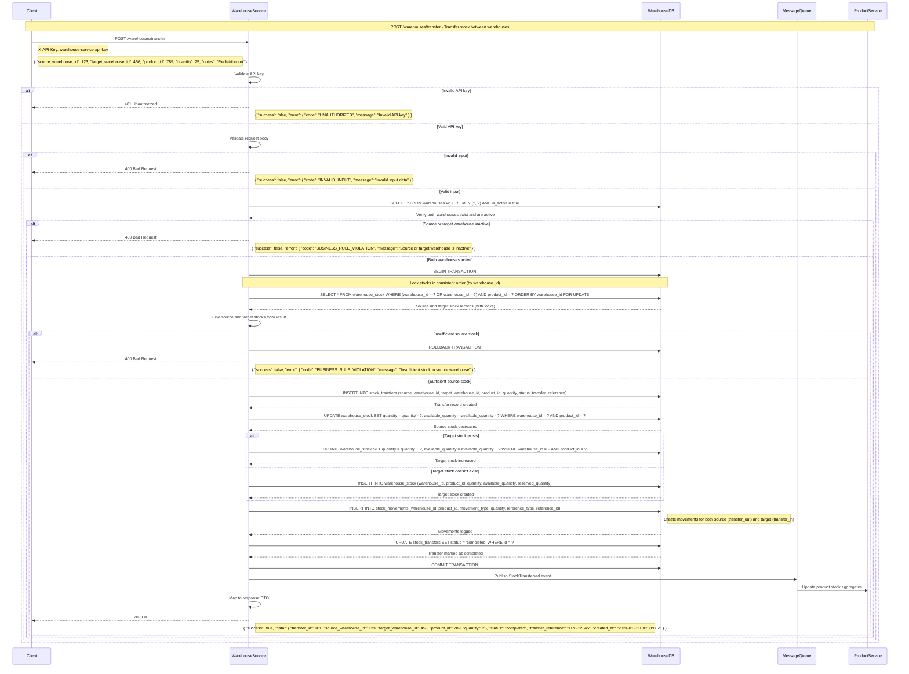
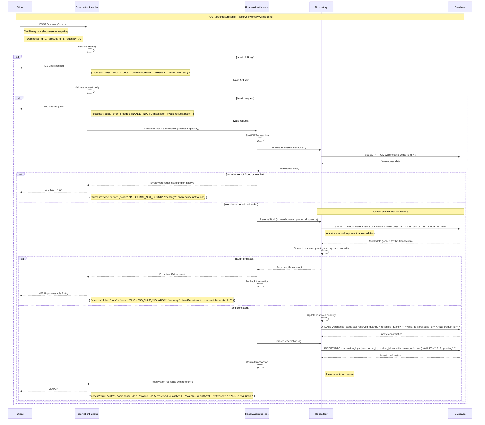
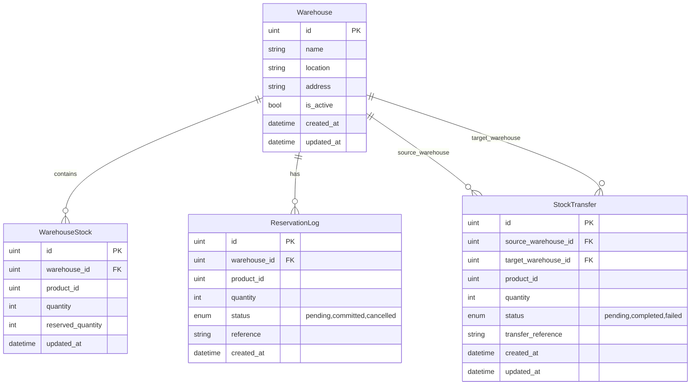

# Warehouse Service

A RESTful API service for warehouse and inventory management built with Go, Fiber framework, and MySQL.

## Features

- Warehouse management (CRUD operations)
- Inventory tracking with stock levels
- Inventory reservation system with database-level locking
- Race condition prevention for concurrent stock operations
- Clean architecture design (repository, usecase, handler)
- MySQL database with migrations
- Containerized with Docker
- Standardized error handling with custom error types
- Request ID tracking for API calls
- Structured JSON logging with context
- Timeout handling and context management
- Consistent API responses

## Prerequisites

To run this application, you need:

- Docker and Docker Compose
- Go 1.24+ (for local development)

## Running with Docker

1. Clone the repository:
   ```
   git clone <repository-url>
   cd user-service
   ```

2. Start the services using Docker Compose:
   ```
   docker-compose up -d
   ```

   This will:
   - Build the user service container
   - Start a MySQL container
   - Run database migrations
   - Start the application on port 3000

3. Access the API at:
   ```
   http://localhost:3000
   ```

## Authentication

All API endpoints are protected with API key authentication. To access the API, you need to include the API key in the `X-API-Key` header of your requests:

```
X-API-Key: warehouse-service-api-key
```

This simplified authentication approach is suitable for service-to-service communication where a shared API key is used. In a production environment, you would:

1. Use unique API keys for each client
2. Store API keys securely in a database
3. Implement rate limiting and monitoring
4. Consider additional authentication methods for user-specific operations

## API Flow

### Get Warehouse Flow



### Create Warehouse Flow



### Get Warehouse Stock Flow



### Add Stock to Warehouse Flow



### Transfer Stock Between Warehouses Flow



### Inventory Reservation Flow (with Database Locking)



## API Endpoints

### Warehouse Management

#### Get Warehouse
```
GET /api/v1/warehouses/:id
```
Headers:
```
X-API-Key: warehouse-service-api-key
```

Response:
```json
{
  "success": true,
  "data": {
    "id": 1,
    "name": "Main Warehouse",
    "location": "New York",
    "is_active": true,
    "created_at": "2025-05-17T09:23:37Z",
    "updated_at": "2025-05-17T09:23:37Z",
    "stats": {
      "product_count": 25,
      "total_items": 1500
    }
  }
}
```

#### Create Warehouse
```
POST /api/v1/warehouses
```
Headers:
```
X-API-Key: warehouse-service-api-key
```
Request Body:
```json
{
  "name": "Main Warehouse",
  "location": "New York",
  "is_active": true
}
```

### Inventory Reservation System

#### Reserve Stock
```
POST /api/v1/inventory/reserve
```
Headers:
```
X-API-Key: warehouse-service-api-key
```
Request Body:
```json
{
  "warehouse_id": 1,
  "product_id": 5,
  "quantity": 10
}
```

Response:
```json
{
  "success": true,
  "data": {
    "warehouse_id": 1,
    "product_id": 5,
    "reserved_quantity": 10,
    "available_quantity": 90,
    "total_quantity": 100,
    "reference": "RSV-1-5-1715969465",
    "status": "pending",
    "reservation_time": "2025-05-18T21:37:45+07:00"
  }
}
```

cURL Example:
```bash
curl -X POST 'http://localhost:3000/api/v1/inventory/reserve' \
  -H 'Content-Type: application/json' \
  -H 'X-API-Key: warehouse-service-api-key' \
  -d '{
    "warehouse_id": 1,
    "product_id": 5,
    "quantity": 10
  }'
```

#### Cancel Reservation
```
POST /api/v1/inventory/reserve/cancel
```
Headers:
```
X-API-Key: warehouse-service-api-key
```
Request Body:
```json
{
  "warehouse_id": 1,
  "product_id": 5,
  "quantity": 10,
  "reference": "RSV-1-5-1715969465"
}
```

Response:
```json
{
  "success": true,
  "data": {
    "message": "Reservation cancelled successfully"
  }
}
```

cURL Example:
```bash
curl -X POST 'http://localhost:3000/api/v1/inventory/reserve/cancel' \
  -H 'Content-Type: application/json' \
  -H 'X-API-Key: warehouse-service-api-key' \
  -d '{
    "warehouse_id": 1,
    "product_id": 5,
    "quantity": 10,
    "reference": "RSV-1-5-1715969465"
  }'
```

#### Commit Reservation
```
POST /api/v1/inventory/reserve/commit
```
Headers:
```
X-API-Key: warehouse-service-api-key
```
Request Body:
```json
{
  "warehouse_id": 1,
  "product_id": 5,
  "quantity": 10,
  "reference": "RSV-1-5-1715969465"
}
```

Response:
```json
{
  "success": true,
  "data": {
    "message": "Reservation committed successfully"
  }
}
```

cURL Example:
```bash
curl -X POST 'http://localhost:3000/api/v1/inventory/reserve/commit' \
  -H 'Content-Type: application/json' \
  -H 'X-API-Key: warehouse-service-api-key' \
  -d '{
    "warehouse_id": 1,
    "product_id": 5,
    "quantity": 10,
    "reference": "RSV-1-5-1715969465"
  }'
```

#### Get Reservation History
```
GET /api/v1/inventory/warehouses/:warehouse_id/products/:product_id/reservations?page=1&limit=20
```
Headers:
```
X-API-Key: warehouse-service-api-key
```

Response:
```json
{
  "success": true,
  "data": {
    "warehouse_id": 1,
    "product_id": 5,
    "total": 3,
    "page": 1,
    "limit": 20,
    "logs": [
      {
        "quantity": 10,
        "status": "committed",
        "reference": "RSV-1-5-1715969465",
        "created_at": "2025-05-18T21:37:45+07:00"
      },
      {
        "quantity": 5,
        "status": "cancelled",
        "reference": "RSV-1-5-1715969155",
        "created_at": "2025-05-18T21:32:35+07:00"
      },
      {
        "quantity": 8,
        "status": "pending",
        "reference": "RSV-1-5-1715968930",
        "created_at": "2025-05-18T21:28:50+07:00"
      }
    ]
  }
}
```

cURL Example:
```bash
curl -X GET 'http://localhost:3000/api/v1/inventory/warehouses/1/products/5/reservations?page=1&limit=20' \
  -H 'X-API-Key: warehouse-service-api-key'
```

### Error Response Format
```json
{
  "success": false,
  "error": {
    "code": "ERROR_CODE",
    "message": "Human readable error message"
  }
}
```

## Local Development

1. Install dependencies:
   ```
   go mod download
   ```

2. Start a local MySQL instance or update the config.json with your database details

3. Run database migrations:
   ```
   make migrate-up
   ```

4. Run the application:
   ```
   make run
   ```
   
   Or run on a custom port (3001):
   ```
   make run-custom-port
   ```

5. Run unit tests:
   ```
   make test
   ```

6. Generate Swagger documentation:
   ```
   make swagger
   ```
   
   Then access the Swagger UI at: http://localhost:3000/swagger/

## Database Schema

### Entity Relationship Diagram



### Notes on Database Implementation

1. **Missing Tables**: 
   - While our sequence diagrams reference a `stock_movements` table, this table is not yet implemented in our migrations or entity models.
   - The `products` table is referenced in queries but not yet implemented.

2. **Computed Fields**:
   - `available_quantity` in `WarehouseStock` is computed on the fly using the formula `quantity - reserved_quantity`.

3. **Type Inconsistencies**:
   - The `warehouse_id` and `product_id` in `reservation_logs` are defined as `BIGINT UNSIGNED` in the migration but as `uint` in the entity.
   
4. **Indexes**:
   - Additional indexes were added to `warehouse_stock` for better query performance.
   - The `reservation_logs` table has indexes on `warehouse_id`, `product_id`, `reference`, and `created_at`.

## Available Make Commands

For a complete list of available commands, run:
```
make help
```

Key commands include:
- `make build`: Build the application
- `make run`: Run the application
- `make test`: Run tests
- `make swagger`: Generate Swagger documentation
- `make docker-up`: Start the application with Docker Compose
- `make docker-down`: Stop Docker Compose services

## End-to-End Testing

The project includes end-to-end tests that verify the complete user flow by testing against a running service.

1. Run E2E tests with Docker (recommended):
   ```
   make test-e2e
   ```

2. Run E2E tests with logs for debugging:
   ```
   make test-e2e-with-logs
   ```

The E2E tests will:
- Start the service with a test database
- Test the user registration endpoint
- Test the user login endpoint with valid and invalid credentials
- Test authentication middleware
- Clean up after the tests

Test results are saved in the `test-results` directory.

## Project Structure

- `/cmd/web`: Main application entry point
- `/internal`: Internal application code
  - `/config`: Configuration handling
  - `/context`: Context management for timeouts and request tracking
  - `/delivery`: HTTP delivery layer
    - `/http/middleware`: HTTP middleware (logging, auth)
    - `/http/response`: Standardized response formatting
    - `/http/route`: API route definitions
  - `/entity`: Domain entities
  - `/errors`: Custom error types and error handling
  - `/handler`: HTTP handlers
  - `/model`: Data models
  - `/repository`: Data access layer
  - `/usecase`: Business logic layer
- `/db/migrations`: Database migration files
- `/e2e`: End-to-end tests
- `/mocks`: Mock interfaces for testing

## Inventory Reservation System and Race Condition Prevention

The warehouse service includes a robust inventory reservation system that uses database-level locking to prevent race conditions when multiple users try to reserve the same stock simultaneously.

### How It Works

1. **Pessimistic Locking**: When a reservation is made, the system uses SQL's `FOR UPDATE` clause to lock the stock record for the duration of the transaction. This prevents other transactions from modifying the same record until the first transaction completes.

2. **Transactional Integrity**: All reservation operations (reserve, cancel, commit) are executed within database transactions, ensuring atomicity and consistency.

3. **Reservation Lifecycle**:
   - **Reserve**: Locks the stock record, checks availability, increases reserved quantity
   - **Cancel**: Locks the stock record, decreases reserved quantity
   - **Commit**: Locks the stock record, decreases both reserved quantity and total quantity

4. **Audit Trail**: All reservation activities are logged in the `reservation_logs` table with timestamps and status.

### Implementation Details

The core of the locking mechanism is implemented in the `ReservationRepository` using GORM's locking API:

```go
// Lock the stock record with FOR UPDATE to prevent concurrent modifications
stock := new(entity.WarehouseStock)
result := tx.Clauses(clause.Locking{Strength: "UPDATE"}).
    Where("warehouse_id = ? AND product_id = ?", warehouseID, productID).
    First(stock)
```

This translates to the following SQL:

```sql
SELECT * FROM warehouse_stock 
WHERE warehouse_id = ? AND product_id = ? 
LIMIT 1 
FOR UPDATE;
```

The `FOR UPDATE` clause acquires an exclusive lock on the selected rows until the transaction is committed or rolled back, preventing race conditions and ensuring that inventory is never over-committed.

## Configuration

Configuration is stored in `config.json`. For Docker, use `config.docker.json`.

Key configurations:
- Web server port (default: 3000)
- Database connection parameters
- Logging level (0-6, with 6 being most verbose)

## Error Handling

The service uses a standardized error handling approach:
- Custom error types with error codes and HTTP status codes
- Consistent error response format
- Contextual error logging
- Request tracking with request IDs

## Logging

Logs are output in JSON format and include:
- Timestamp
- Log level
- Request ID for request tracing
- Contextual information
- Method and path for API requests
- Response status and latency
- SQL query tracing (in debug mode)